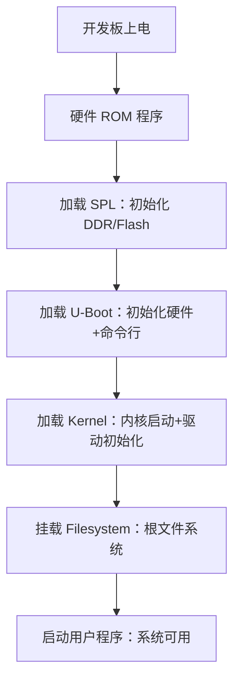

# 嵌入式 Linux 核心组件解析笔记
> 适用场景：嵌入式 Linux 开发（如 T113/Lichee Pi Nano 等开发板），梳理从底层启动到上层系统运行的核心组件，便于开发、调试及文档归档。

## 一、核心组件定义与功能（按启动流程排序）
### 1. SPL（Secondary Program Loader，二级程序加载器）
- **通俗理解**：开机引导的「第一步助手」，芯片上电后运行的第一个软件（比 U-Boot 更底层）。
- **核心作用**：
  - 芯片上电后，硬件先执行内置「ROM 程序」（出厂固化，不可修改），但 ROM 功能极简，仅能加载 SPL；
  - 初始化最基础硬件（DDR 内存、Flash 存储），为加载体积更大的 U-Boot 准备内存环境；
  - 加载完成后，将控制权移交 U-Boot。
- **常见形态**：文件名为 `spl.bin`，需烧写到 Flash 特定启动分区（如 NAND Flash 启动分区）。

### 2. U-Boot（Universal Bootloader，通用引导程序）
- **通俗理解**：系统启动的「总管家」，嵌入式系统核心引导程序。
- **核心作用**：
  - 接收 SPL 控制权后，进一步初始化硬件（网卡、串口、存储设备等）；
  - 提供串口命令行交互（修改启动参数、烧写镜像、网络下载等）；
  - 从 Flash/SD 卡/网络加载 Kernel 到内存，传递设备树（DTS）和启动参数，最终启动内核。
- **常见形态**：文件名为 `u-boot.bin` 或 `u-boot.img`，烧写到 Flash 的 `bootloader` 分区。

### 3. Kernel（Linux 内核）
- **通俗理解**：操作系统的「核心骨架」，硬件与上层软件的「桥梁」。
- **核心作用**：
  - 管理硬件资源（CPU、内存、GPIO、LCD 等外设）；
  - 提供进程调度、内存管理、文件系统支持、设备驱动等核心功能；
  - 启动后挂载根文件系统，初始化用户空间第一个进程（`init`/`systemd`）。
- **常见形态**：文件名为 `zImage`（压缩内核，常用）或 `Image`（未压缩内核），烧写到 Flash 的 `kernel` 分区。

### 4. Filesystem（文件系统/根文件系统 RootFS）
- **通俗理解**：操作系统的「软件仓库」，存储所有用户程序、配置文件、库文件的容器（类似 Windows 的 `C:\Windows` + `C:\Program Files`）。
- **核心作用**：
  - 提供标准目录结构（`/bin` 命令、`/etc` 配置、`/lib` 库文件、`/home` 用户数据等）；
  - 包含系统运行必需组件：Shell 终端、基础命令（`ls`/`cd`）、动态库（`*.so`）、配置文件等；
  - 内核启动后必须挂载根文件系统，否则会触发 `Kernel panic`（无法运行用户程序）。
- **常见形态**：
  - 镜像格式：`rootfs.ext4`（ext4 格式，通用）、`rootfs.jffs2`（Flash 专用）、`rootfs.squashfs`（只读压缩）；
  - 烧写到 Flash 的 `rootfs` 分区。

### 5. Linux 系统镜像文件（完整可烧写镜像）
- **通俗理解**：包含所有核心组件的「完整安装包」，按 Flash 分区结构打包后的成品文件。
- **核心作用**：简化烧写流程，无需手动分区和单独烧写 SPL/U-Boot/Kernel/RootFS，直接写入存储设备（SD 卡/NAND/eMMC）即可开机。
- **常见形态**：
  - 完整镜像：`xxx.img`（如 `tlt113-minievm-nand.img`），包含所有分区的二进制数据；
  - 烧写工具：`dd` 命令、BalenaEtcher（图形化）、厂商专用工具（如全志 PhoenixSuit）。

### 6. Tools（开发/辅助工具）
- **通俗理解**：嵌入式开发的「工具箱」，不烧写至开发板，但为编译、调试、烧写提供支持。
- **分类与常用工具**：
  | 工具类型       | 代表工具                                  | 核心用途                                  |
  |----------------|-------------------------------------------|-------------------------------------------|
  | 编译工具       | 交叉编译器（arm-linux-gcc）、Buildroot、Make | 编译内核、驱动、根文件系统、应用程序      |
  | 烧写工具       | dd、BalenaEtcher、PhoenixSuit              | 将镜像文件写入 SD 卡/Flash 存储设备       |
  | 调试工具       | SecureCRT/Putty（串口）、adb、gdb          | 查看启动日志、调试程序、硬件交互          |
  | 辅助工具       | dtc（设备树编译）、mkfs.ext4（文件系统制作） | 编译 DTS 文件、制作根文件系统镜像          |

## 二、启动流程核心关系

## 三、项目场景关联（以 T113 开发板为例）
  1. 编译 Buildroot → 生成 Filesystem（根文件系统镜像，如 rootfs.ext4）；
  2. 编译内核源码 → 生成 Kernel（zImage）和设备树（*.dtb）；
  3. 编译 U-Boot 源码 → 生成 SPL（spl.bin）和 U-Boot（u-boot.img）；
  4. 打包所有组件 → 生成 Linux 系统镜像文件（如 tlt113-minievm-nand.img）；
  5. 使用 Tools（如 BalenaEtcher） → 将镜像烧写至 SD 卡，开发板上电启动。

## 四、关键问题速查
| 常见报错 / 问题	                | 关联组件                	| 排查方向                                   |
|---------------------------------|-------------------------|--------------------------------------------- |
| Kernel panic: 无法挂载根文件系统	|  Filesystem/Kernel	    |  根文件系统镜像格式错误、启动参数中分区路径错误  |
| U-Boot 无法识别 LCD 屏幕	        |  U-Boot / 设备树	        |  U-Boot 中 LCD 配置错误、设备树节点未适配      |
| 镜像烧写后无法开机	              |  SPL/U-Boot	            |  烧写地址错误、SPL/U-Boot 未适配开发板         |
| 应用程序无法运行	                |  交叉编译器 / Filesystem	|  编译器架构不匹配、根文件系统缺少依赖库         |
